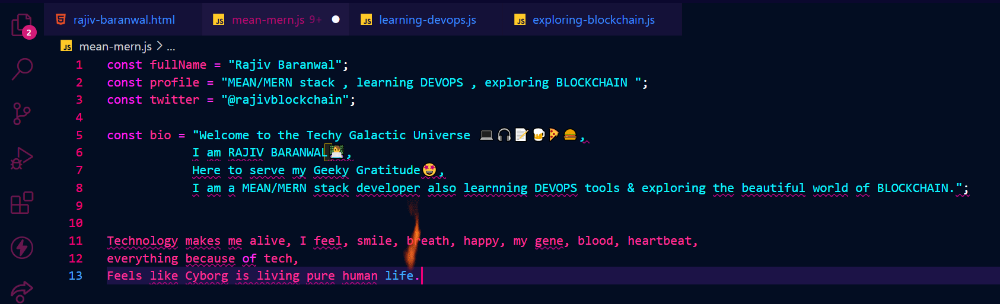

 

### Hey Beautiful and loving technoMates.💓
 <ul>
            <li>Welcome to the Techy Galactic Universe 💻🎧📝🍺🍕🍔,</li> 
            <li>I am <b><i>RAJIV BARANWAL👨‍💻,  </b></i>
            <li>Here to serve my Geeky Gratitude🤩,</li>
            <li>I am a <b>MEAN/MERN</b> stack developer also <b>learnning DEVOPS<b/> tools & exploring the beautiful world of BLOCKCHAIN. </li> 
            </ul>
             
            
 
 
 
 
 
 
 
 
 

 
  
 
            

 
 
              

             
             

        

<!--
**rajivbar/rajivbar** is a ✨ _special_ ✨ repository because its `README.md` (this file) appears on your GitHub profile.

Here are some ideas to get you started:

- 🔭 I’m currently working on ...
- 🌱 I’m currently learning ...
- 👯 I’m looking to collaborate on ...
- 🤔 I’m looking for help with ...
- 💬 Ask me about ...
- 📫 How to reach me: ...
- 😄 Pronouns: ...
- ⚡ Fun fact: ...

Shayari-----
Binary(gaur) code farmayega
geeky sa dil h, code k pyyar m ghulmil h , jidhar deku bs debugging ki mahfil , 

subhah ki sham sham ki subhah har taraf bs vs code ki jhilmil h 

-->
