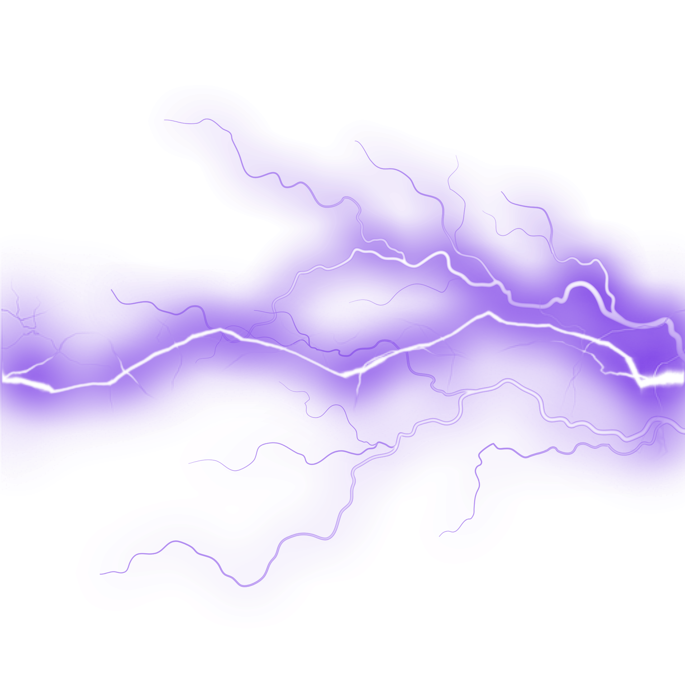
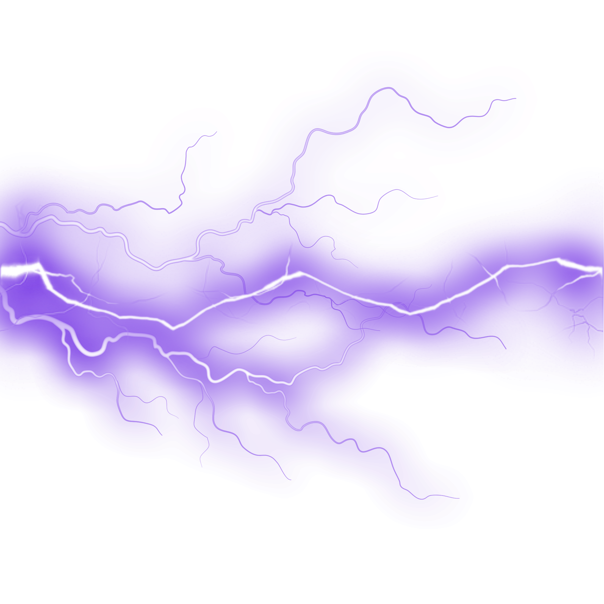

### Hey Awesome and loving technoMates.💓
 
- Welcome to the Techy Galactic Universe 💻🎧📝🍺🍕🍔,
- I am <b><i>RAJIV BARANWAL👨‍💻,</i></b>
- I am non biological extraterrestrial technocrate human being,
- Here to serve my Geeky Gratitude🤩,
- I am a <b>MEAN/MERN</b> stack developer also <b>learnning DEVOPS<b/> tools & exploring the beautiful world of BLOCKCHAIN.
 
 &nbsp; &nbsp;
 
 &nbsp; 
 
 &nbsp; 
 
            

<!--

-->

            
<!--  
 
 
 
 
 
 
 
  -->

 
 
&nbsp;
## 💻 Technologies I Work With

<!--  -->

<!-- 

 -->

  

<!-- 
 -->
 <!--  -->

<!-- 
 -->

  
  
## 📱 Apps I use

 
 <!-- 

 -->
 <!--  -->

 
  
 
 

  
 

 
 

 
 
 
 

            

 
 
 
 

 
 

             
             

        

<!--
**rajivbar/rajivbar** is a ✨ _special_ ✨ repository because its `README.md` (this file) appears on your GitHub profile.

Here are some ideas to get you started:

- 🔭 I’m currently working on ...
- 🌱 I’m currently learning ...
- 👯 I’m looking to collaborate on ...
- 🤔 I’m looking for help with ...
- 💬 Ask me about ...
- 📫 How to reach me: ...
- 😄 Pronouns: ...
- ⚡ Fun fact: ...

Shayari-----
Binary(gaur) code farmayega
geeky sa dil h, code k pyyar m ghulmil h , jidhar deku bs debugging ki mahfil , 

subhah ki sham sham ki subhah har taraf bs vs code ki jhilmil h 

-->
